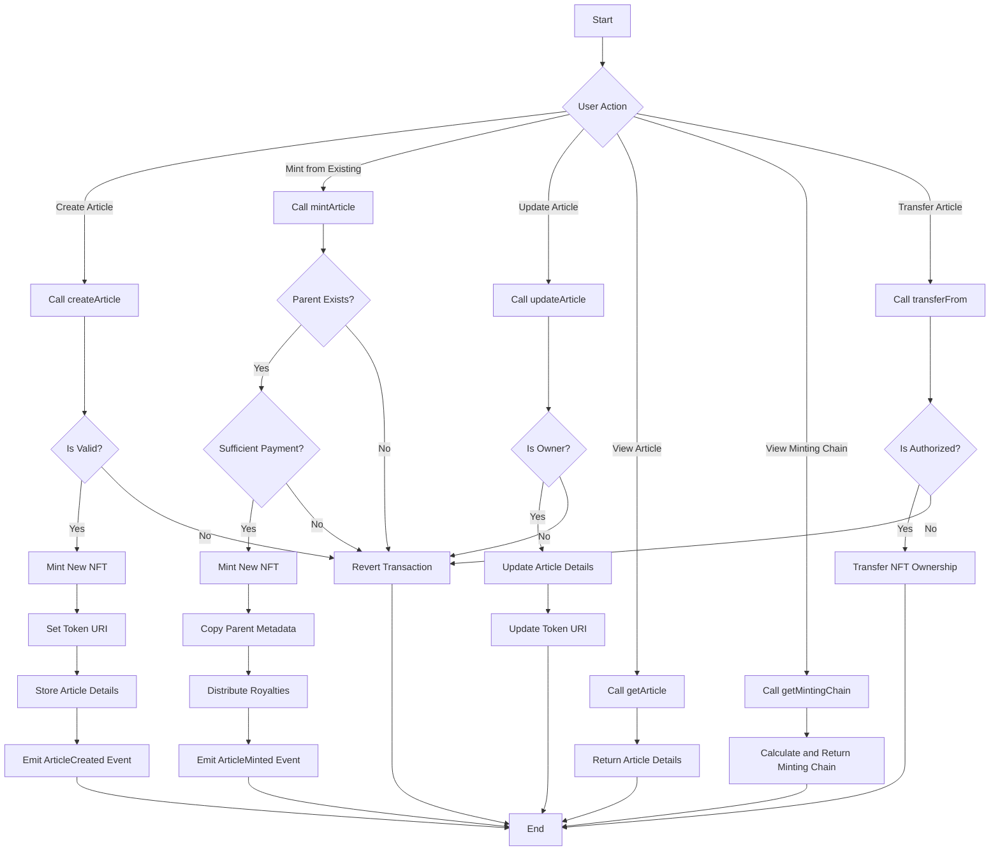

# PRISM: Decentralized Content Ecosystem

PRISM is a revolutionary decentralized content ecosystem that leverages blockchain technology and NFTs to create a fair, transparent, and rewarding environment for content creators and consumers alike. By implementing a unique Multi-Level Marketing (MLM) structure, PRISM ensures that value is distributed across the network, incentivizing content creation, curation, and sharing.

## Table of Contents

- [Overview](#overview)
- [Features](#features)
- [MLM Structure](#mlm-structure)
- [Revenue Model](#revenue-model)
- [Process Flow](#process-flow)
- [Function Descriptions](#function-descriptions)
- [Getting Started](#getting-started)
- [Contributing](#contributing)

## Overview

PRISM allows users to tokenize digital articles as NFTs, creating a verifiable chain of ownership and provenance for written content. This system enables content creators to monetize their work, readers to support authors directly, and a transparent ecosystem for digital publishing. The innovative MLM structure encourages content sharing and curation, creating a self-sustaining content economy.

## Features

- Create and mint Article NFTs
- Update article content (for owners)
- View article details and minting history
- Transfer ownership of Article NFTs
- Multi-level marketing structure for content sharing
- Revenue sharing between platform, creators, and curators

## MLM Structure

PRISM implements a Multi-Level Marketing structure for content sharing and curation:

1. **Level 0 (Original Creator)**: The original author of the content.
2. **Level 1**: Users who directly mint or share content from the original creator.
3. **Level 2**: Users who mint or share content from Level 1 users.
4. **Level 3**: Users who mint or share content from Level 2 users.

This structure can extend to multiple levels, with diminishing returns at each level to ensure sustainability.

## Revenue Model

PRISM's revenue model benefits both the platform and its users:

### For Users:

1. **Content Creators**: Earn revenue from initial sales and ongoing royalties from subsequent mints.
2. **Curators**: Earn a percentage of sales when their shared content is minted by others.
3. **Readers**: Potential to earn by identifying and sharing valuable content early.

### For Platform:

1. **Minting Fees**: A small fee is collected for each new NFT minted.
2. **Transaction Fees**: A percentage of each sale or transfer is collected by the platform.
3. **Premium Features**: Additional revenue from premium account features or services.

### Revenue Distribution Example:

When a new Article NFT is minted from an existing one:
- 50% goes to the original creator
- 30% is distributed among the levels in the MLM structure
- 20% goes to the PRISM platform

This model incentivizes quality content creation, active curation, and platform growth.

## Process Flow

The following flowchart illustrates the main processes and decision points in the Article NFT system:



## Function Descriptions

1. `createArticle`: Creates a new Article NFT with original content.
2. `mintArticle`: Mints a new NFT based on an existing article, establishing a derivative relationship.
3. `updateArticle`: Allows the owner to update the content of their Article NFT.
4. `getArticle`: Retrieves the details of a specific Article NFT.
5. `getMintingChain`: Returns the lineage of an Article NFT, showing its derivation history.
6. `transferFrom`: Transfers ownership of an Article NFT to a new address.

# Getting Started
>
> ```git clone https://github.com/deoxicit/Prism.git```

## Backend

1. >```cd PrismContract```

2. > ```forge install```

3. > Update env with appropriate values

### Deploy contract
>
> forge create Prism --rpc-url opencampuscodex --private-key=private_Key --constructor-args {primary_contract_owner_address}

### Verify Deployed Contract
>
> forge verify-contract --rpc-url <https://rpc.open-campus-codex.gelato.digital> --verifier blockscout --verifier-url '<https://opencampus-codex.blockscout.com/api/>' {contract_address} --compiler-version v0.8.26 src/Prism.sol:Prism

## Frontend

1. >```cd frontend```

2. > ```pnpm install```

### Update env with appropriate values

3. > ```pnpm run dev```

## Contributing

We welcome contributions to the [PRISM]("https://github.com/deoxicit/Prism").
