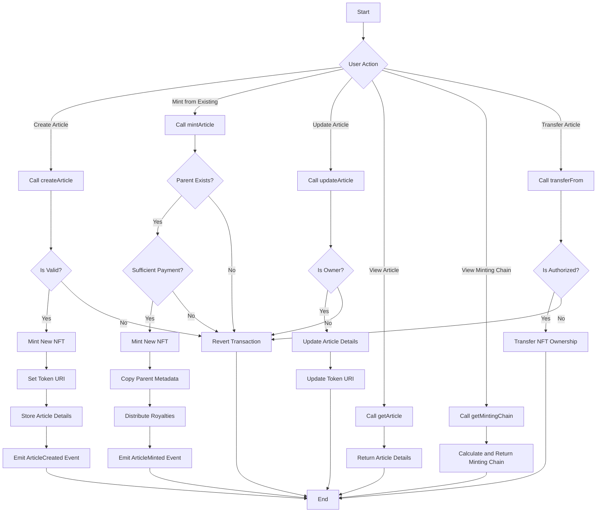

# PRISM

This project implements a system for creating, minting, updating, viewing, and transferring Article NFTs. It provides a set of smart contract functions to manage the lifecycle of digital articles as non-fungible tokens on the blockchain.

## Table of Contents
- [Overview](#overview)
- [Features](#features)
- [Process Flow](#process-flow)
- [Function Descriptions](#function-descriptions)
- [Getting Started](#getting-started)
- [Contributing](#contributing)
- [License](#license)

## Overview

The Article NFT Project allows users to tokenize digital articles as NFTs, creating a verifiable chain of ownership and provenance for written content. This system enables content creators to monetize their work, readers to support authors directly, and a transparent ecosystem for digital publishing.

## Features

- Create new Article NFTs
- Mint new NFTs from existing articles
- Update article content (for owners)
- View article details
- Examine the minting chain of an article
- Transfer ownership of Article NFTs

## Process Flow

The following flowchart illustrates the main processes and decision points in the Article NFT system:

## Function Descriptions

1. `createArticle`: Creates a new Article NFT with original content.
2. `mintArticle`: Mints a new NFT based on an existing article, establishing a derivative relationship.
3. `updateArticle`: Allows the owner to update the content of their Article NFT.
4. `getArticle`: Retrieves the details of a specific Article NFT.
5. `getMintingChain`: Returns the lineage of an Article NFT, showing its derivation history.
6. `transferFrom`: Transfers ownership of an Article NFT to a new address.

## Getting Started

(Add instructions here on how to set up the project, deploy smart contracts, and interact with the system)

## Contributing

We welcome contributions to the Article NFT Project. Please read our contributing guidelines before submitting pull requests.

## License

(Add your chosen license information here)